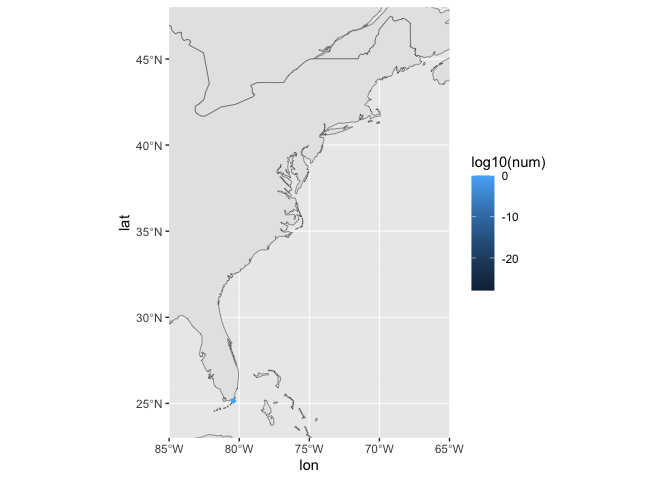

Often we will want to model the dispersal of an organism over multiple generations, or something similar. Let us, for now, imagine modeling a semelparous organism, and imagine it starts at a specific point, and each generation it will release a certain number of larvae into a habitat in which the larvae face no competion. Where will those larvae end up, and how many will make it?

It is **important** to notice that the connectivity that this simple model describes is highly unlikely to be applicable to actual observed spread of larvae *which recruit succesfully.* In any more realistic ecosystem, competition with existing adults of all species, and competition with larvae of other species, will usually significantly alter the spatial patterns of realized connectivity. This is particularly true near the edge of species ranges (Lush & Pringle, in prep, 2023). The models below estimates of the number of larvae which enter the plankton in one place, are then transported by ocean currents could reach another place. The realized connectivity will also depend on the biological processes (e.g. competition, predation) which control the number of larvae which survive the trip and recruit.

Before going further, let us load the connectivity data defined in 03_GetData_Subset_and_Combine.RMD:

```{r getSavedData}
E<-readRDS('mayJuneEastCoast_connectivity.RDS')
```

### Define habitat

The connectivity data described above extends to the greater of 100km from land and 500m water depth and a global alongshore extent. Many marine organisms will have different habitats, and can only spread from where they do live to a location where they might live. So in any analysis of connectivity, the connectivity must be limited to the region that is habitable to the species in question. In the `connectivityUtilities.R` there are routines to limit the habitat to within a polygon (as described in `03_GetData_Subset_and_Combine.RMD`), to a certain distance from land in kilometers, to a certain distance from land in model grid-points, and to a certain depth range. To use these routines, `connectivityUtilities.R` must be sourced:

```{r sourceConnectivityUtilties.R}
  source('connectivityUtilities.R')
```

Besides defining the functions we need to subset the habitat, `connectivityUtilities.R` also defines three matrices that give the water depth on the model grid (`gridDepth`), the distance from land in kilometers (`gridDistKm`) and the distance from land in model grid cells (`gridDist`). As an example of how to plot this data, here we sample the distance from land at the starting locations of the connectivity data E, and plot it:

```{r showDepth}
    #get the water depth on the starting points
    theLons<-E$lonFrom
    theLats<-E$latFrom
    theDistsKm<-gridDistKm[cbind(E$nxFrom,E$nyFrom)]
    theLonLat<-data.frame(theLons=theLons,theLats=theLats,theDistsKm=theDistsKm)

    #and plot
    library("rnaturalearth")
    library("rnaturalearthdata")
    world <- ne_countries(scale = "medium", returnclass = "sf")
    class(world)
    
    p<-ggplot(data = world) +
      geom_sf() +
      coord_sf(xlim= c(-85, -60), ylim = c(23, 48), expand = FALSE)
    p<-p+geom_point(data = theLonLat, aes(x = theLons, y = theLats, fill=theDistsKm,colour=theDistsKm), size = 1, shape = 23)
    print(p)
```

In `connectivityUtilities.R`, a function `subsetConnectivity_byGridValue` is defined which takes one of the quantities defined on the model grid and uses it to subset the connectivity data. It is called with`subsetConnectivity_byGridValue(E,gridValues,minValue,maxValue,trimTo=FALSE)` where

-   `E` is the existing connectivity data
-   `gridValues` is a matrix like gridDepth, gridDist, or gridDistKm, defined on the model grid
-   `minValue` is the minimum value of gridValue that will allow a point to be included in the habitat
-   `maxValue` is the maximum value of gridValue that will allow a point to be included in the habitat
-   `trimTo` determines if we include particles which start inside the included habitat but settle outside in the new connectivity data, or if we exclude them. if `trimTo=True`, they are excluded.

In general, for computing connectivity over multiple generations, it is best to set `trimTo=TRUE`.

As an example, lets define `Enearshore` which only includes particles which start in waters shallower than 25m. The following code makes `Enearshore` and plots it.

```{r eNearshore}
    Enearshore<-subsetConnectivity_byGridValue(E,gridDepth,0.0,25.0,trimTo=TRUE)
    p<-ggplot(data = world) + geom_sf() + 
      coord_sf(xlim= c(-85, -60), ylim = c(23, 48), expand = FALSE)+
      geom_point(data = Enearshore, aes(x = lonFrom, y = latFrom), size = 1, shape = 23, fill = "green",color='green')
    print(p) #this makes the figure appear
```

### Define initial condition

There is now a connectivity data.frame for the nearshore points, `Enearshore`. The next step is to define the initial distribution locations to disperse from, and the quantity of things to disperse from that location. This is a data.frame that contains the columns `nx`, `ny`, and `num`. `(nx,ny)` is the location of a point, and `num` is the number of critters (which can be a fraction like 0.02) at that point. So let us define a point somewhere near the southern extent of the habitat (which we find by looking at `(lonFrom,latFrom)` in `Enearshore`)

```{r makeCritters}
    critters<-data.frame(nx=2478,ny=1806,num=1.0)
```

The latitude and longitude of these points can be added with the function `addLatLon2orgDist()`. This is simply for plotting and readability, but is not needed for calculating dispersal.

```{r addLatLon}
    critters<-addLatLon2orgDist(critters)
    print(critters)
```

This gives us the starting distribution of organisms. There is **no** reason that the initial distribution is a single organism. It could be many more.

### Define growth

With a finite habitat, and dispersal that can go anywhere in an ocean, many drifting larvae will end up outside of the habitat and lost. However, a single individual can release more than one larva. In the code below, we will define a growth rate R. It is important to understand what this R is, for it may differ from the usage of R in other context. It is the number of propagules that each individual releases that would be expected to survive until the settlement time -- e.g. net of mortality in the plankton. **However**, many of these surviving propagules may be outside of the habitat, and thus not survive into the next generation. *In subsequent parts of this document, the actual population growth rate will be calculated*. It is important to note that in most cases, if `R` is 1.0, the total number of critters `sum(critters$num)` will decrease after dispersal, because some propagules will have ended up outside of the habitat.

### Run one dispersal generation, and plot

To calculate the dispersal and growth over one generation, the `propagateOneGeneration(E,connectDict,orgDist,R)` function is used. `E` is the dispersal data, `connectDict` is a dictionary that need only be calculated once for a single connectivity data.frame `E` with `makeConnectionDict<-function(E)`, `orgDist` is the distribution of organisms (the `critters` above), and `R` is a number that gives the growth rate as defined above.

```{r goOneGen}
    R=1.0
    connectDict<-makeConnectionDict(Enearshore)
    nextGenCritters<-propagateOneGeneration(Enearshore,connectDict,critters,R)
```

It is interesting to determine if the total population has increased or decreased, and to plot where the initial and final distribution of critters is.

```{r disperPlot1}
    print(paste('The initial total population was',sum(critters$num),'and after one generation there are',sum(nextGenCritters$num)))
    critters<-addLatLon2orgDist(critters)
    nextGenCritters<-addLatLon2orgDist(nextGenCritters)
    p<-ggplot(data = world) + geom_sf() + 
      coord_sf(xlim= c(-85, -65), ylim = c(23, 35), expand = FALSE)+
      geom_point(data = Enearshore, aes(x = lonFrom, y = latFrom), size = 1, shape = 23, fill = "seagreen",color='seagreen',alpha=0.2)+
      geom_point(data = nextGenCritters, aes(x = lon, y = lat), size = 1, shape = 23, fill = "green",color='green')+
      geom_point(data = critters, aes(x = lon, y = lat), size = 1, shape = 23, fill = "red",color='red')+
      ggtitle('the starting location is the red dot,\nthe bright green is the distribution after 1 generation,\nand the dark green is the habitat')
    print(p) #this makes the figure appear

```

### Run multiple dispersal generations, and plot

It is interesting to know how the distribution of the initial inoculation changes over time. It is also useful to know how the population changes over time if `R` is 1. This is a measure of the fraction of larvae lost to offshore. The code below looks at this in the simple limit that `R`=1 for a single species that experiences no density-dependent effects and is not in competition with any other species in the habitat. The spatial distribution of available habitat is as defined above. It is **important** to remember the caveat from the top of this page -- the observed spread of the organism is likely much faster than would occur in a realistic ocean where larvae would compete for resources with other larvae. This is particularly relevant when a species is expanding its range upstream (e.g. in this case, North of Cape Hatteras).

To animate the evolution of the distribution of the introduced critter, a data.frame `allGenerations` will be built from multiple generations of dispersal of the initial critter distribution. A column `generation` will be added. The gganimate package will then be used to animate this data.frame. Start by build `allGenerations`:

```{r runGenerations}
    numGen<-10 #the number of generations to run
    R<-1.0 #define R 
    critters<-data.frame(nx=2478,ny=1806,num=1.0) #make initial critter distribution
    critters<-addLatLon2orgDist(critters)
    allGenerations<-data.frame(lon=critters$lon,lat=critters$lat,num=critters$num,generation=0) #put initial condition into allGenerations
    initCritters <- critters #save initial condition for latter plotting
    for (thisGen in 1:numGen) {
      critters<-propagateOneGeneration(Enearshore,connectDict,critters,R) #advance critters one generation
      critters<-addLatLon2orgDist(critters) #add lat lon
      critters$generation<-thisGen #add generation column to critters
      allGenerations<-rbind(allGenerations,critters[c('lon','lat','num','generation')])
      #print(thisGen)
    }
```

The results of this dispersal can be animated with the `gganimate` package

```{r animateDispersal}
   library(gganimate) #to make this work, you might also have to install the gifski library
    p<-ggplot(data = world) + geom_sf() + 
      coord_sf(xlim= c(-85, -65), ylim = c(23, 48), expand = FALSE)+
      geom_point(data = allGenerations, aes(x = lon, y = lat,fill=log10(num),colour=log10(num)), 
                 size = 1, shape = 23)+
      transition_manual(generation)
      #ggtitle('the starting location is the red dot,\nthe bright green is the distribution after 1 generation,\nand the dark green is the habitat')
    #print(p) #this makes the figure appear in interactive sessions
    anim_save('rangeExpand.gif',p)
```

If you are running this interactivly, and can't find your plot in the plot window, either load the file `rangeExpand.gif` into your browser, or type `print(p)`... Also look at any error messages that are generated -- you may need to install the `gifski` package.



The total population in the entire habit can easilly be calculated. Here the `log10()` of the total population is shown; if the fraction each generation lost is roughly constant, it should be a line. Why? because if $P^{t+1}=R_{eff}P^t$, then $P(t)=P_0*R_{eff}^t$, and $log_{10}$ of that is $log_{10}(P(t))=R_{eff}*t+log_{10}(P_0)$, where $P_0$ is the initial population.

```{r calculateTotalPop}
totalPop<- allGenerations %>% group_by(generation) %>% summarize(totalPopulation=sum(num))
totalPop$log10totalPopulation<-log10(totalPop$totalPopulation)
p<-ggplot(data=totalPop,aes(x=generation,y=log10totalPopulation))+geom_line()+geom_point()
print(p)
```
